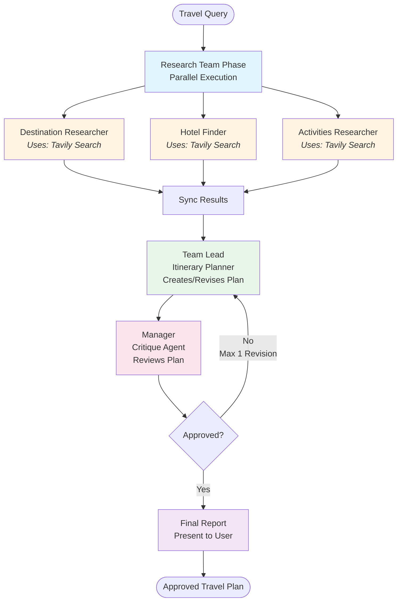

# Multi-Agent Travel Planner with Agno Workflows and Langfuse Observability


A production-ready travel planning system built with Agno's workflow orchestration and comprehensive Langfuse observability. Features parallel agent execution, manager approval loops, and full trace monitoring.

## Features

- **🎨 Modern Web Interface**: Beautiful Gradio UI for easy interaction
- **Parallel Research**: 3 specialized agents (destination, hotel, activities) run simultaneously for efficiency
- **Manager Approval Loop**: Team lead creates plans, manager reviews with max 1 revision cycle
- **Full Observability**: Complete Langfuse tracing with OpenLIT instrumentation
- **Structured Outputs**: Pydantic schemas ensure consistent, validated responses
- **Professional Architecture**: Modular design with reusable components

## Project Structure

```
agno-langfuse-travel-planner/
├── main.py                    # Entry point - run this
├── frontend/                  # Gradio web interface
│   ├── __init__.py           # Module exports
│   └── app.py                # Gradio interface with dark theme
├── core/                      # Configuration & utilities
│   ├── config.py             # Langfuse & OpenLIT initialization
│   ├── schemas.py            # Pydantic models
│   └── utils.py              # Agent observation wrapper
├── agents/                    # Agent definitions
│   ├── research_agents.py    # Destination, hotel, activities researchers
│   ├── planner_agent.py      # Itinerary planner (team lead)
│   └── critique_agent.py     # Travel plan reviewer (manager)
├── tools/                     # Agent tools
│   └── web_search.py         # Tavily web search with tracing
└── workflows/                 # Workflow components
    ├── steps.py              # Step definitions
    ├── critique_logic.py     # Critique & revision logic
    └── travel_workflow.py    # Main workflow assembly
```

## Module Breakdown

### `core/`

- **config.py**: Initializes Langfuse client and OpenLIT instrumentation
- **schemas.py**: Pydantic models for structured agent outputs (DestinationInfo, AccommodationOptions, etc.)
- **utils.py**: Helper functions like `make_agent_observable()` for Langfuse tracing

### `agents/`

- **research_agents.py**: Three parallel research agents (destination, hotel, activities)
- **planner_agent.py**: Team lead agent that synthesizes research into travel plans
- **critique_agent.py**: Manager agent that reviews and approves plans

### `tools/`

- **web_search.py**: Tavily web search tool with Langfuse observation

### `workflows/`

- **steps.py**: Individual workflow step definitions
- **critique_logic.py**: Custom critique function and loop end condition
- **travel_workflow.py**: Complete workflow assembly with parallel and loop components

## Workflow Architecture



## Quick Start

We start working by clone the repository and install the dependencies.

```bash
git clone https://github.com/cikalmerdeka/agno-langfuse-travel-planner.git
cd agno-langfuse-travel-planner
```

1. **Install dependencies**:

In this project, we use modern Python package manager, uv, to manage the dependencies. To use the pyproject.toml file, you can use the following command:

```bash
uv sync
```

This will install all the dependencies listed in the pyproject.toml file. You can also use the following command to install the dependencies:

```bash
uv add -r requirements.txt
```

2. **Set up environment variables** (`.env`):

```env
OPENAI_API_KEY=your_openai_key
TAVILY_API_KEY=your_tavily_key
LANGFUSE_SECRET_KEY=your_langfuse_secret
LANGFUSE_PUBLIC_KEY=your_langfuse_public
LANGFUSE_HOST=https://cloud.langfuse.com
```

You can get the keys from the following links:

- OpenAI: https://platform.openai.com/
- Tavily: https://tavily.com/
- Langfuse: https://langfuse.com/

3. **Run the application**:

```bash
python main.py
```

This launches a modern Gradio web interface at `http://localhost:7860`

## How It Works

1. **Parallel Research**: Three agents simultaneously gather destination info, hotel options, and activities
2. **Plan Creation**: Team lead synthesizes research into comprehensive travel plan
3. **Manager Review**: Critique agent evaluates completeness, coherence, and practicality
4. **Revision (if needed)**: Team lead refines plan based on feedback (max 1 revision)
5. **Final Delivery**: Manager-approved plan presented to user

## Observability

All agent interactions, tool calls, and workflow steps are traced in Langfuse:

- Agent-level tracing with custom names
- Tool call monitoring (Tavily searches)
- Session state tracking for revisions
- Complete input/output logging
- Performance metrics and cost tracking

I have ran the script myself and you may check the example trace in the Langfuse for the Workflow approach and Async Team approach below:

- Workflow approach: [Link](https://cloud.langfuse.com/project/cmjh2ili300m9ad07yz62xdp9/traces/0a10c0aa12ff977829621d704b0f03a7?timestamp=2025-12-27T16:51:17.130Z)
- Async Team approach: [Link](https://cloud.langfuse.com/project/cmjh2ili300m9ad07yz62xdp9/traces/ee4292bdd73c25e8ce2931808c6c64df?timestamp=2026-01-04T19:09:14.581Z)

## Tech Stack

- **Gradio**: Modern web interface framework
- **Agno**: Agent framework with workflow orchestration
- **Langfuse**: Observability and tracing
- **OpenLIT**: LLM instrumentation
- **OpenAI**: GPT-4.1-nano (You can change the model to your own liking, make sure to consider the latency, cost, and accuracy)
- **Tavily**: Web search API
- **Pydantic**: Data validation and structured outputs

## 🎨 Web Interface

The application includes a Gradio web interface with:

- **Dark Theme UI**: Clean dark background with white text for better readability
- **Example Queries**: 5 pre-built travel planning examples
- **Copy to Clipboard**: One-click copy of generated travel plans
- **Formatted Output**: Markdown rendering with proper structure
- **Status Updates**: Real-time workflow status messages
- **Responsive Design**: Works on desktop and mobile devices

### Interface Features:

- Input form with multi-line text support
- Clickable example queries for quick testing
- Status indicator showing workflow progress
- Copy button to export travel plans as markdown
- Collapsible workflow information section
